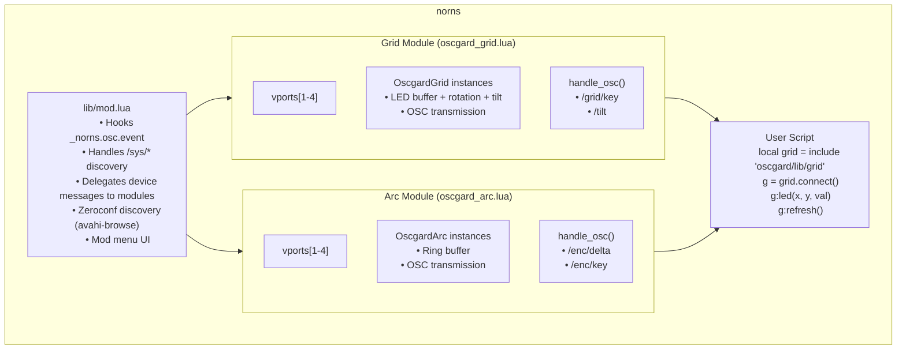

# Oscgard Architecture

Technical breakdown of how oscgard works, for developers and AI agents working on the codebase.

---

## System Overview

Oscgard is a norns mod that intercepts monome grid/arc API calls and routes them to OSC client devices (e.g. TouchOSC). Devices are discovered via zeroconf (`avahi-browse` for `_osc._udp` services) and assigned to ports through the mod menu.

### Architecture Principles

- **mod.lua** is the high-level orchestrator — handles OSC routing, discovery, device lifecycle, and the mod menu
- **oscgard_grid.lua** and **oscgard_arc.lua** are self-contained device modules managing their own vports, device instances, and OSC protocol
- **vport_module.lua** is a shared factory providing common vport management (connect, disconnect, slot lookup)
- **buffer.lua** is a shared packed bitwise storage module used by both grid and arc devices
- mod.lua has no direct knowledge of device implementation details — it delegates via a consistent module interface



---

## Component Details

### 1. Mod Entry Point (`lib/mod.lua`)

The mod orchestrates the system. It does not create devices or handle device-specific OSC directly.

#### Initialization

```lua
-- Hook _norns.osc.event (not osc.event) for priority handling
-- _norns.osc.event is the C-level callback that scripts cannot overwrite
original_norns_osc_event = _norns.osc.event
_norns.osc.event = oscgard_osc_handler
```

Initialization happens both eagerly (when included from a script) and via `system_post_startup` hook (when loaded as a mod). A `_G.oscgard_mod_loaded` flag prevents double-loading.

#### OSC Routing

```lua
local function oscgard_osc_handler(path, args, from)
    -- /sys/* → discovery responses (accumulate device info)
    if path:sub(1, 5) == "/sys/" then
        -- Handle /sys/type, /sys/id, /sys/prefix, /sys/size, /sys/rotation, /sys/sensors
        -- Also live-updates assigned devices on /sys/size and /sys/rotation changes
        return
    end

    -- Everything else → match against assigned devices by IP + port + prefix
    local _, _, device = find_device_by_address(ip, port, path)
    if device then
        if grid_module.handle_osc(path, args, device, prefix) then return end
        if arc_module.handle_osc(path, args, device, prefix) then return end
    end

    -- Pass unhandled to original handler
    original_norns_osc_event(path, args, from)
end
```

Device matching uses `find_device_by_address(ip, port, path)` which checks all assigned devices across both grid and arc modules, matching on IP, port, and OSC path prefix.

#### Zeroconf Discovery

```lua
-- 1. Scan for _osc._udp services via avahi-browse
local services = scan_osc_services()

-- 2. Send /sys/info to each discovered service
for _, svc in ipairs(services) do
    osc.send({svc.host, svc.port}, "/sys/info", {})
end

-- 3. Accumulate responses into oscgard.discovered_devices (keyed by "host:port")
-- 4. After 5s scan duration, display in mod menu for user assignment
```

#### Device Lifecycle

```lua
-- Creation (called from mod menu after user selects a device)
local device = device_module.create_vport(slot, client, cols, rows, serial)
device.prefix = prefix       -- from discovery
device:rotation(rotation)    -- from discovery

-- Removal (called from mod menu or shutdown)
device_module.destroy_vport(slot)
```

#### Mod Hooks

| Hook | Action |
|------|--------|
| `system_post_startup` | Initialize OSC handler |
| `system_pre_shutdown` | Remove all devices, restore original OSC handler |
| `script_post_cleanup` | Clear all LEDs, force refresh (keeps devices connected) |

---

### 2. Device Modules (`lib/oscgard_grid.lua`, `lib/oscgard_arc.lua`)

Both modules export a consistent interface, created via `vport_module.new()`:

```lua
module = {
    -- State
    vports = { [1-4] },      -- Array of vport objects
    add = nil,                -- Callback: device connected
    remove = nil,             -- Callback: device disconnected

    -- Lifecycle (called by mod.lua)
    create_vport(slot, client, cols, rows, serial),
    destroy_vport(slot),

    -- OSC handling (called by mod.lua)
    handle_osc(path, args, device, prefix) -> bool,

    -- Public API (called by scripts via grid.lua/arc.lua)
    connect(port) -> vport,
    connect_any() -> vport | nil,
    disconnect(slot),
    get_slots() -> vports,
    get_device(slot) -> device | nil,
}
```

#### Grid Module

The grid vport provides: `led`, `all`, `refresh`, `rotation`, `intensity`, `tilt_enable`.

Grid-specific OSC handling:
- `<prefix>/grid/key` — button press (0-indexed → 1-indexed, calls `device.key(x, y, z)`)
- `<prefix>/tilt` — tilt sensor data (0-indexed → 1-indexed, calls `device.tilt(n, x, y, z)`)

#### Arc Module

The arc vport provides: `led`, `all`, `segment`, `refresh`, `intensity`, `ring_map`, `ring_range`.

Arc-specific OSC handling:
- `<prefix>/enc/delta` — encoder rotation (0-indexed → 1-indexed, calls `device.delta(n, d)`)
- `<prefix>/enc/key` — encoder press (0-indexed → 1-indexed, calls `device.key(n, z)`)

---

### 3. Vport Factory (`lib/vport_module.lua`)

Provides shared vport management so device modules only define device-specific logic:

```lua
function vport_module.new(device_type, create_vport_fn) -> module
```

The factory creates:
- `vports[1-4]` — initialized from `create_vport_fn()`
- `destroy_vport(slot)` — calls `device:cleanup()`, fires `remove` callback, clears vport
- `connect(port)`, `connect_any()`, `disconnect(slot)`, `get_slots()`, `get_device(slot)`

`MAX_SLOTS = 4` (matching norns port limits).

---

### 4. Buffer Module (`lib/buffer.lua`)

Packed bitwise storage used by both grid and arc devices.

#### API

```lua
local Buffer = include 'oscgard/lib/buffer'
local buf = Buffer.new(total_leds)

-- LED operations
buf:get(index)                 -- Get brightness at index (1-based) -> 0-15
buf:set(index, brightness)     -- Set brightness (auto-marks dirty, skips if unchanged)
buf:set_all(brightness)        -- Set all LEDs

-- Dirty tracking
buf:has_dirty()                -- Any dirty flags set?
buf:set_dirty(index)           -- Mark single LED dirty
buf:clear_dirty()              -- Clear all dirty flags
buf:mark_all_dirty()           -- Mark all dirty

-- Change detection
buf:has_changes()              -- Compare new_buffer vs old_buffer (word-by-word)
buf:commit()                   -- Copy new_buffer → old_buffer

-- Reset
buf:clear()                    -- Zero all LEDs, mark all dirty

-- Serialization
buf:to_hex_string()            -- Convert to hex string ("f00a...")
buf:from_hex_string(hex)       -- Load from hex string

-- Debug
buf:stats()                    -- Memory usage info
```

#### Memory Layout

```
For 128 LEDs (16x8 grid):
- new_buffer: 16 words (64 bytes)
- old_buffer: 16 words (64 bytes)
- dirty: 4 words (16 bytes)
- Total: 144 bytes

Each 32-bit word packs 8 LEDs (4 bits each):
┌─────┬─────┬─────┬─────┬─────┬─────┬─────┬─────┐
│LED7 │LED6 │LED5 │LED4 │LED3 │LED2 │LED1 │LED0 │
│28-31│24-27│20-23│16-19│12-15│ 8-11│ 4-7 │ 0-3 │
└─────┴─────┴─────┴─────┴─────┴─────┴─────┴─────┘

Dirty flags: 1 bit per LED, 4 words for 128 LEDs
```

---

### 5. Grid Device Class (`OscgardGrid` in `oscgard_grid.lua`)

Each connected grid client gets its own instance.

**Properties**: `id`, `cols`, `rows`, `logical_cols`, `logical_rows`, `rotation_val`, `prefix`, `client`, `serial`, `name`, `type`, `device_type`, `buffer`, `key`, `tilt`.

**Key methods**:
- `led(x, y, z)` — set LED in logical coords (1-indexed), bounds-checked
- `all(z)` — set all LEDs
- `refresh()` — sends hex state if buffer has dirty changes
- `force_refresh()` — immediate full send
- `rotation(val)` — set rotation (0-3), updates logical dims, sends `/sys/rotation`
- `tilt_enable(id, val)` — sends `<prefix>/tilt/set` to client (1→0 indexed)
- `send_level_full(hex)` — sends `<prefix>/grid/led/state` with hex string
- `send_level_map`, `send_level_set`, `send_level_all`, `send_level_row`, `send_level_col` — serialosc-compatible methods

**Refresh logic**:
```lua
function OscgardGrid:refresh()
    if self.buffer:has_dirty() then
        if self.buffer:has_changes() then
            self:send_level_full(self.buffer:to_hex_string())
        end
        self.buffer:commit()
        self.buffer:clear_dirty()
    end
end
```

> Refresh is unthrottled — it sends whenever dirty changes exist, relying on the calling script's own refresh rate.

---

### 6. Arc Device Class (`OscgardArc` in `oscgard_arc.lua`)

Each connected arc client gets its own instance.

**Constants**: `NUM_ENCODERS = 4`, `LEDS_PER_RING = 64`, `WORDS_PER_RING = 8`.

**Properties**: `id`, `num_encoders`, `prefix`, `client`, `serial`, `name`, `type`, `device_type`, `buffer`, `delta`, `key`.

**Key methods**:
- `led(ring, x, val)` — set single LED (1-indexed)
- `all(val)` — set all LEDs
- `segment(ring, from_angle, to_angle, level)` — anti-aliased arc segment (radians), additive blending
- `ring_map(ring, levels)` — set all 64 LEDs on ring from array
- `ring_range(ring, x1, x2, val)` — set range of LEDs with wrapping
- `refresh()` — sends ring state if buffer has dirty changes
- `send_ring_state()` — sends `<prefix>/ring/state` with N hex strings (64 chars each)

---

### 7. Drop-in Modules (`lib/grid.lua`, `lib/arc.lua`)

Thin wrappers that mirror the norns grid/arc API. They:
1. Include `lib/mod.lua` to get the oscgard instance
2. Expose `vports` from the corresponding device module
3. Wire up `add`/`remove` callbacks
4. `grid.lua` provides module-level convenience functions (`grid.led`, `grid.refresh`, etc.) that operate on vport 1, plus `cleanup()` to clear callbacks on script change
5. `arc.lua` is minimal — provides `connect()` and `rotation()` only (arc scripts use the vport object returned by `arc.connect()` for all operations)

---

## Data Flow

### LED Update Flow

```
Script: g:led(5, 3, 15)
  → OscgardGrid:led(5, 3, 15)
  → buffer:set(index, 15)  [marks dirty, stores in new_buffer]

Script: g:refresh()
  → OscgardGrid:refresh()
  → buffer:has_dirty() → true
  → buffer:has_changes() → true (new != old)
  → buffer:to_hex_string() → "000...f...000"
  → osc.send(client, <prefix>/grid/led/state, {hex_string})
  → buffer:commit() + clear_dirty()
```

---

## Mod Menu

The mod menu (`mod.menu.register("oscgard", m)`) provides a multi-page UI:

| Page | Purpose |
|------|---------|
| **main** | Lists connected devices. E2 to scroll, E3 to toggle compat mode, K3 to remove or add. |
| **type** | Select device type (grid / arc). E2 to select type, K3 to confirm and start scan. |
| **discover** | Scan network, list available devices. E2 to browse results, E3 CW to rescan, K3 to assign. |

Port is auto-assigned to the first free vport for the selected device type.

Navigation: K2 to go back, K3 to select/action.
